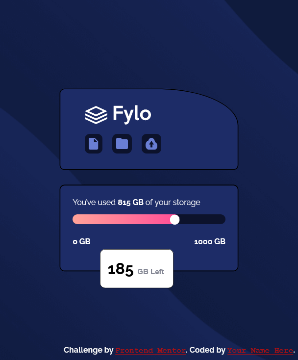
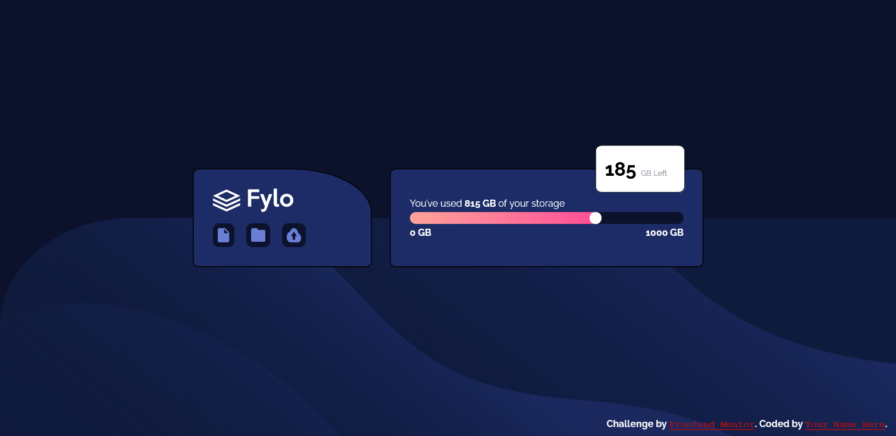

# Frontend Mentor - Fylo data storage component solution

This is a solution to the [Fylo data storage component challenge on Frontend Mentor](https://www.frontendmentor.io/challenges/fylo-data-storage-component-1dZPRbV5n). Frontend Mentor challenges help you improve your coding skills by building realistic projects.

## Overview

### The challenge

### Screenshot

### Links

- Solution URL: [live site](https://ketannegi.github.io/Flyo_data_frontentmentor/)

## My process

### Built with

- Semantic HTML5 markup
- CSS custom properties
- Flexbox

## Author

- Website - [githun](https://github.com/ketannegi/Flyo_data_frontentmentor/edit/main)
- Frontend Mentor - [@ketannegi](https://www.frontendmentor.io/profile/ketannegi)

*
